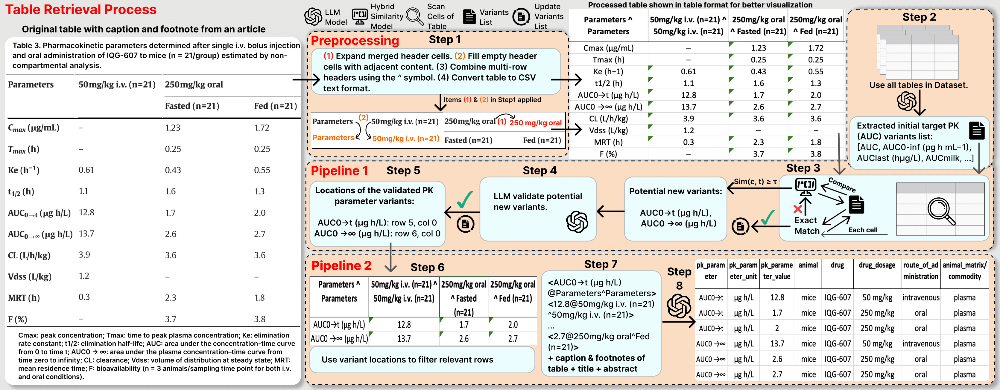

# 
# <div align="center">AutoPK: Leveraging LLMs and a Hybrid Similarity Metric for Advanced Retrieval of Pharmacokinetic Data from Complex Tables and Documents</div>


<div align="center">
<p>
<a href="#️-installation">Installation</a> |
<a href="#-quick-start">Quick Start</a> |
<a href="#-evaluation">Evaluation</a> |
<a href="#-arguments">Arguments</a> |
<a href="https://ieeexplore.ieee.org/document/11272455">Paper</a> |
<a href="https://arxiv.org/abs/2510.00039">ArXiv version</a> |
<a href="docs/project_details.md">More Details</a>
</p>
</div>

## 🔎 Overview



## 🗺️ Roadmap

- [x] Release modules  
- [x] Release evaluation code  
- [ ] Release dataset (pending permissions) 

## 🛠️ Installation

Clone the repo and install dependencies:

```bash
git clone https://github.com/hosseinsholehrasa/AutoPK.git
cd AutoPK
pip install -r requirements.txt
````

>  It’s recommended to use a virtual environment before installing and running the project:

```bash
python -m venv .venv
source .venv/bin/activate  # Linux/Mac
.venv\Scripts\activate     # Windows
```


### 🔑 Environment Setup

Set your API keys (if using OpenAI / Hugging Face models). You can either:

* Use environment variables directly:

  ```bash
  export OPENAI_API_KEY="your_api_key"
  export OPENAI_BASE_URL="https://your-proxy-if-any"
  export HF_TOKEN="your_huggingface_token"
  ```

* Or create a `.env` file in the project root:

  ```env
  OPENAI_API_KEY=your_api_key
  OPENAI_BASE_URL=https://your-proxy-if-any
  HF_TOKEN=your_huggingface_token
  ```

## 📊 Evaluation

Run evaluations with a specific model:

```bash
python main.py --model <model_name>
```

### Example with GPT-4o-mini:

```bash
python main.py --model gpt-4o-mini
```

This will:

1. Load datasets from `dataset/`
2. Run preprocessing → form detection → structured extraction
3. Log results into `experiments/evaluation_logs/`

* **Text logs**:
  `experiments/evaluation_logs/eval_log_<model>_<timestamp>.txt`

* **JSON results**:
  `experiments/evaluation_logs/eval_log_<model>_<timestamp>.json`
  (with precision, recall, F1, hallucination rate, runtime, etc.)
  
---

## 🔧 Arguments

| Argument   | Description                                                                 |
|------------|-----------------------------------------------------------------------------|
| `--model`  | Name of the LLM to use for structured extraction (e.g., `phi3`, `gpt-4o-mini`, `llama3`). |


## 📖 Citation

If you find this repository useful, please consider giving a ⭐ or citing our work:

```bibtex
@INPROCEEDINGS{autopk_sholehrasa,
  author={Sholehrasa, Hossein and Ghanaatian, Amirhossein and Caragea, Doina and Tell, Lisa A. and Riviere, Jim E. and Jaberi-Douraki, Majid},
  booktitle={2025 IEEE 37th International Conference on Tools with Artificial Intelligence (ICTAI)}, 
  title={AutoPK: Leveraging LLMs and a Hybrid Similarity Metric for Advanced Retrieval of Pharmacokinetic Data From Complex Tables and Documents}, 
  year={2025},
  volume={},
  number={},
  pages={338-346},
  keywords={Drugs;Terminology;Large language models;Decision making;Standardization;Data retrieval;Safety;Data mining;Pharmacokinetics;Public healthcare;Pharmacokinetic Data Extraction;Automated;Information Retrieval (IR);Table Reconstruction;Table Information Extraction;Large Language Models (LLMs);Pharmacology Data Processing Pipeline},
  doi={10.1109/ICTAI66417.2025.00051}}

